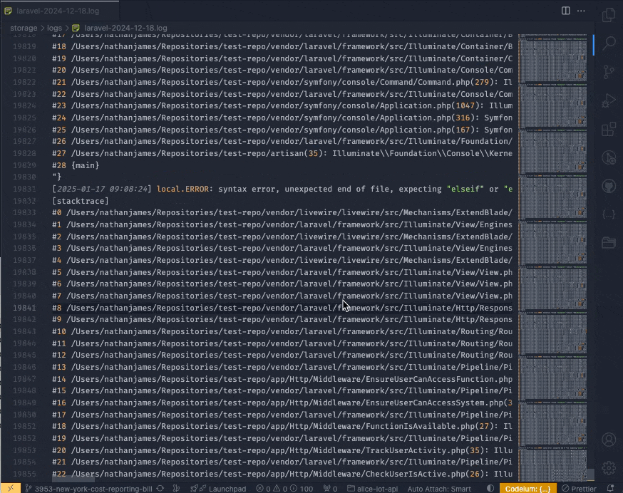

# Laravel Log Viewer

View your Laravel Logs in a easy-to-read table, with filters and pagination.

## Features

- Easy to navigate table with pagination
- Filters to search on date, severity and message
- ...more to come (make an issue if you have a request!)

For example if there is an image subfolder under your extension project workspace:

## Extension Settings

## Known Issues

This extension is new, so please create in issue if you encounter any issues!

## Release Notes

Users appreciate release notes as you update your extension.

### 0.0.1

Initial release of the extension.

---
